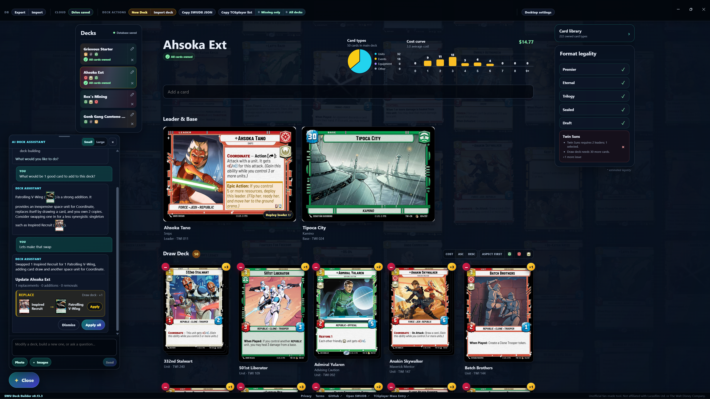

# Star Wars: Unlimited Deck Builder

A deck-building companion for [Star Wars: Unlimited](https://starwarsunlimited.com/). Browse the card catalog, build and organize decks, check their structure, track your collection, and move decks between popular SWU tools.

[Open the hosted app](https://swu.wuteri.ch/) · [Download the desktop app](https://github.com/Alfwich/swu-deck-builder/releases/latest) · [Play exported decks on ForceTable](https://www.forcetable.net/)

[Privacy Policy](https://swu.wuteri.ch/privacy) · [Terms of Service](https://swu.wuteri.ch/terms)



> This independent fan project is not affiliated with or endorsed by Lucasfilm Ltd., Fantasy Flight Games, or SWUDB.

## Features

- Search and browse the Star Wars: Unlimited card catalog with artwork, filters, set information, and estimated prices.
- Create and manage multiple decks, including work-in-progress lists, sideboards, and Twin Suns second leaders.
- Review deck statistics, cost curves, aspect penalties, card ownership, and format-aware structural checks.
- Keep a revision history for each deck and undo, redo, or inspect recent changes.
- Track a card collection and see which cards are missing from a deck or across several decks.
- Import and export [SWUDB](https://swudb.com/decks/)-compatible deck data and open exported decks in [ForceTable](https://www.forcetable.net/).
- Optionally back up the player database to the app-specific area of Google Drive.
- Use the optional AI Deck Assistant to build decks, suggest reviewable changes, identify cards from images, or answer deck-building questions.
- Run in a web browser or as a desktop application for Windows, macOS, and Linux.

## Local-first by design

Decks, collections, history, and chat state stay on the device by default. The hosted app uses browser storage, while the desktop app keeps its database in the user's application-data directory.

Google Drive backup and AI assistance are optional. Data is sent to those services only when their related features are enabled and used. See the [Privacy Policy](https://swu.wuteri.ch/privacy) for details.

## Get started

Use the [hosted app](https://swu.wuteri.ch/) immediately, or download the latest desktop package from [GitHub Releases](https://github.com/Alfwich/swu-deck-builder/releases/latest):

- Windows x64: installer
- macOS: universal DMG or ZIP
- Linux x64: DEB or RPM

## Run from source

Development requires Node.js 22 or newer and npm.

```powershell
npm install
npm run dev
```

Open `http://127.0.0.1:5173`. The project automatically prepares a local environment and obtains the public card catalog when needed.

Useful commands:

| Command | Purpose |
| --- | --- |
| `npm run help` | List all available project commands |
| `npm test` | Run the test suite |
| `npm run lint` | Check the codebase with ESLint |
| `npm run build` | Create the production web build |
| `npm run desktop:start` | Build and launch the desktop app |

Configuration options are documented in [.env.example](./.env.example). Maintainer notes for the hosted Linux service live in [ops/deploy/README.md](./ops/deploy/README.md).

## Project structure

```text
src/          React application and deck-building logic
server/       Express API and optional AI integrations
desktop/      Electron desktop runtime
scripts/      Catalog, build, packaging, and maintenance tools
test/         Node test suite
docs/         Policies, release notes, and supporting documentation
```

The application uses React 19 and Vite in the browser, Node.js and Express for its local API, and Electron for desktop packages.

## License and attribution

Released under the [BSD Zero Clause License (0BSD)](./LICENSE). Aspect icons are sourced from [ForceTable](https://www.forcetable.net/).
